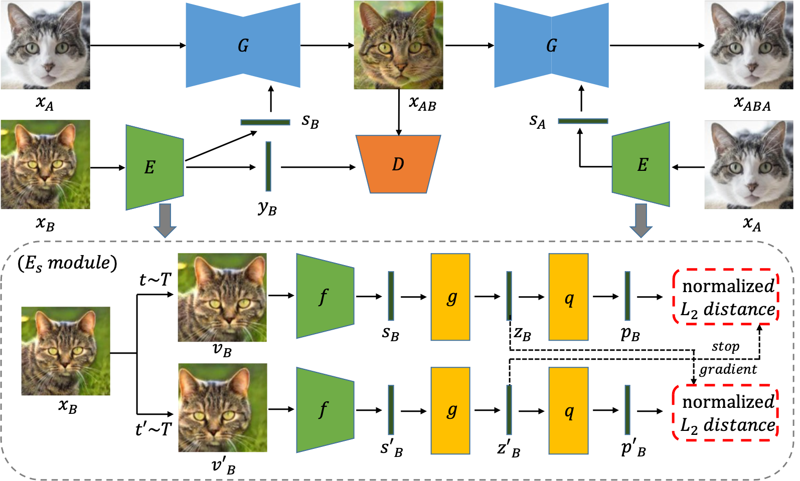

## Truly Unsupervised Image-to-Image Translation with Contrastive Representation Learning (ACCV2022)

> __Truly Unsupervised Image-to-Image Translation with Contrastive Representation Learning__   
> Zhiwei Hong, Jianxing Feng, and Tao Jiang
> __Absract__ _Image-to-image translation is a classic image generation task that attempts to translate an image from the source domain to an analogous image in the target domain. Recent advances in deep generative networks have shown remarkable capabilities in translating images among different domains. Most of these models either require pixel-level (with paired input and output images) or domain-level (with image domain labels) supervision to help the translation task. However, there are practical situations where the required supervisory information is difficult to collect and one would need to perform truly unsupervised image translation on a large number of images without paired image information or domain labels. In this paper, we present a truly unsupervised image-to-image translation model that performs the image translation task without any extra supervision. The crux of our model is an embedding network that extracts the domain and style information of the input style (or reference) image with contrastive representation learning and serves the translation module that actually carries out the translation task. The embedding network and the translation module can be integrated together for training and benefit from each other. Extensive experimental evaluation has been performed on various datasets concerning both cross-domain and multi-domain translation. The results demonstrate that our model outperforms the best truly unsupervised image-to-image translation model in the literature. In addition, our model can be easily adapted to take advantage of available domain labels to achieve a performance comparable to the best supervised image translation methods when all domain labels are known or a superior performance when only some domain labels are known._

This source code will be released soon...